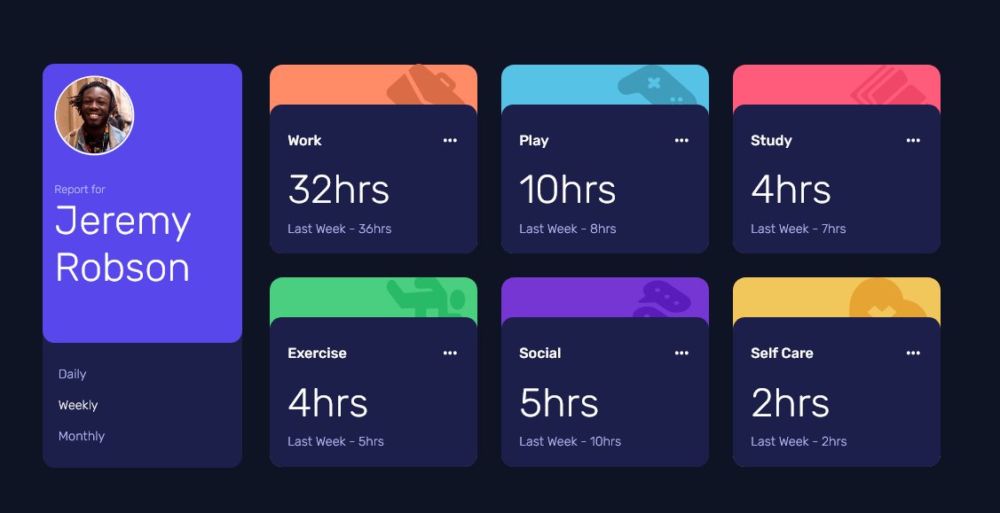

# Frontend Mentor - Time tracking dashboard solution

This is a solution to the [Time tracking dashboard challenge on Frontend Mentor](https://www.frontendmentor.io/challenges/time-tracking-dashboard-UIQ7167Jw). Frontend Mentor challenges help you improve your coding skills by building realistic projects. 

## Table of contents

- [Overview](#overview)
  - [The challenge](#the-challenge)
  - [Screenshot](#screenshot)
  - [Links](#links)
- [My process](#my-process)
  - [Built with](#built-with)
  - [What I learned](#what-i-learned)
  - [Continued development](#continued-development)
  - [Useful resources](#useful-resources)
- [Author](#author)
- [Acknowledgments](#acknowledgments)

**Note: Delete this note and update the table of contents based on what sections you keep.**

## Overview

### The challenge

Users should be able to:

- View the optimal layout for the site depending on their device's screen size
- See hover states for all interactive elements on the page
- Switch between viewing Daily, Weekly, and Monthly stats

### Screenshot




### Links


- Live Site URL: [https://oluwafemi21.github.io/time-tracker-dashboard-frontendmentor/](https://oluwafemi21.github.io/time-tracker-dashboard-frontendmentor/)

## My process

### Built with

- Semantic HTML5 markup
- CSS 3
- Flexbox
- CSS Grid
- Mobile-first workflow
- Brackets.io Code Editor
- [Styled Components](https://styled-components.com/) - For styles


### What I learned

I learnt how positioning affects z-index. I also finally got to practice CSS grid.


```css
main {
  display: grid;
}
```

### Continued development

Areas I will continue focuing in on future projects
- CSS Grid
- Mobile-First Workflow


### Useful resources

- [Example resource 1](https://www.youtube.com/watch?v=x7tLPhnA06w) - This helped me for better understanding on CSS GRID. I really liked this pattern of teaching and will use it going forward. I'd recommend it to anyone still learning this concept.


## Author

- Website - [Oluwafemi Olukoya]
- Frontend Mentor - [@Oluwafemi21](https://www.frontendmentor.io/profile/Oluwafemi21)
- Twitter - [@femi_io](https://www.twitter.com/femi_io)


## Acknowledgments

Practice brings forth improvement.
